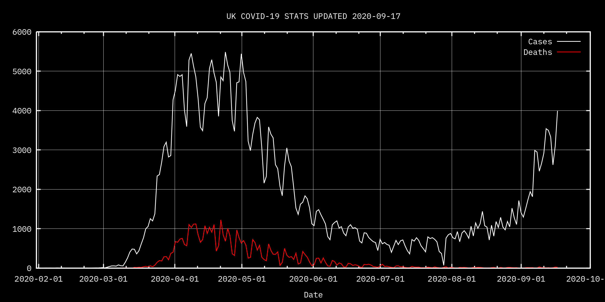

# nbt5_coronalogger

A basic bash script that, when installed and configured correctly, performs the following actions:

- Uses curl to pull today's COVID-19 cases and deaths for the UK from the COVID-19 tracker-cli project, hosted at https://github.com/trackercli/covid19-tracker-cli, and adds this data to a simple CSV file.
- Uses gnuplot to create a graph in png format showing all data to date.

## Installation

_This quick installation intro assumes you're using Linux or a Unix-like system such as macOS. If you're running Windows then I'm afraid you're on your own._

### Dependencies

You must have curl and gnuplot installed. On Ubuntu-based Linux systems they can be installed with the following commands:

	sudo apt install curl
	sudo apt install gnuplot

On macOS you can use homebrew:

	/bin/bash -c "$(curl -fsSL https://raw.githubusercontent.com/Homebrew/install/master/install.sh)"
	brew install gnuplot

### Script installation

Navigate to the parent directory where you want the coronalogger directory to reside. You can safely store it in cloud storage such as Dropbox.

Install the files with git clone:

	git clone https://github.com/nbt5/coronalogger.git

Now navigate to the coronalogger directory. It contains the following files:

- coronagraph.gnuplot. This is the config file for gnuplot. If you want to customise the look of the graph, you change the parameters in here.
- coronagraph.png - an example version of the graph.
- coronalogger.sh - the bash script.
- coronastats.csv - the raw data in CSV format.

Make sure to make the script executable with the following command:

	chmod +x coronalogger.sh

If you want to update the graph manually, all you need to is execute coronalogger.sh once a day. However, it's better to schedule it as an automatic job. To do this you will need root privileges. On Linux and macOS systems, edit your crontab file (usually located at /etc/crontab) to execute the script as root once per day, ideally in the evening.

If you have moved coronalogger.sh anywhere outside the default directory, edit it in your text editor of choice and make sure the file paths are correct (see comments in script for details).
